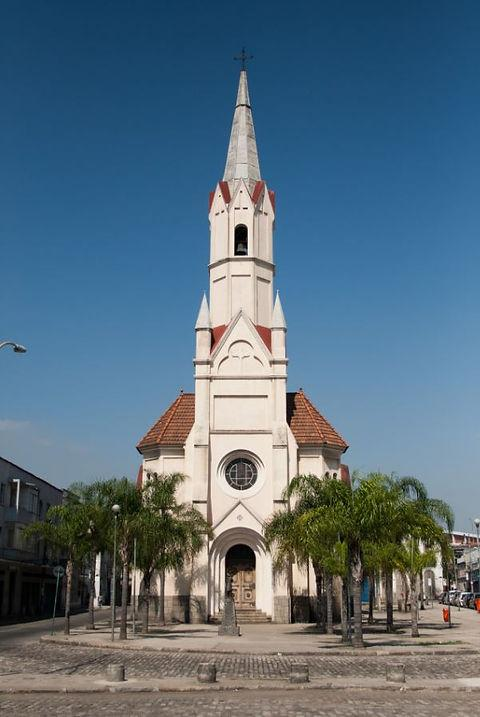
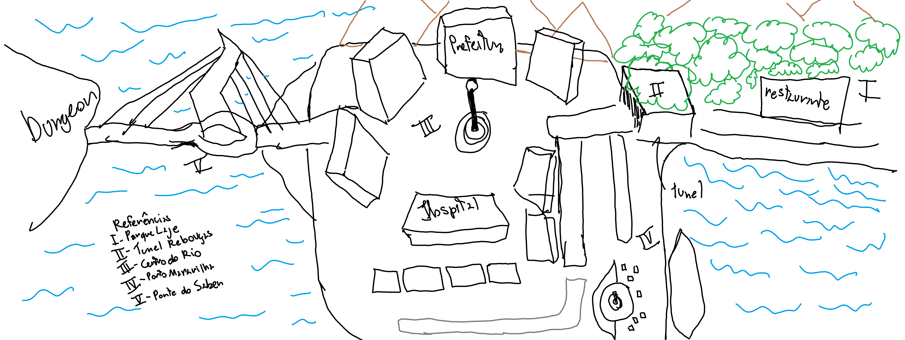

# Art Bible — Loot & Lunch

# Art Bible — Loot & Lunch

> Documento que define a direção artística e as principais regras para criação dos elementos visuais do jogo.
> 

**Versão:** 1.0

**Responsável pela Direção de Arte:** (Nome)

---

## 1. Estilo Artístico

### 1.1 Geral

Um Rio de Janeiro familiar, monumental, belo e mágico, mas estranhamente vazio. (Posteriormente percorrendo todo Brasil)

> **Palavras-chave:**
> 
> 
> Monumental · Mágico · Familiar · Vazio · Misterioso · Brasileiro
> 

### 1.2 Pilares Visuais

- Rio de Janeiro Bonito
    
    **Loot & Lunch utiliza o Rio de Janeiro como uma das principais bases de sua identidade visual, explorando sua arquitetura, vegetação, infraestrutura e espaços históricos como elementos fundamentais dos ambientes.**
    
    **A identidade brasileira não deve depender apenas de pontos turísticos. Elementos cotidianos também devem contribuir para o reconhecimento da cidade, explorando especialmente a relação entre natureza e urbanização, arquitetura histórica e infraestrutura moderna.**
    
    Princípios
    
    - Valorizar arquitetura e paisagem brasileiras.
    - Utilizar vegetação tropical na composição.
    - Explorar o contraste entre natureza e urbanização.
    - Misturar arquitetura histórica e infraestrutura moderna.
    - Utilizar elementos cotidianos do Rio.
    - Evitar uma representação genérica de cidade fantástica.
- Magia
    
    **A magia faz parte do cotidiano do mundo e deve coexistir com a arquitetura e os elementos urbanos, modificando, alimentando ou complementando estruturas existentes.**
    
    **Sua principal identificação visual é a energia vermelha, que pode aparecer desde pequenos detalhes em objetos e construções até grandes estruturas e fenômenos sobrenaturais. Sua intensidade varia conforme o ambiente, podendo ser discreta em locais cotidianos e históricos ou dominante em áreas de maior influência sobrenatural.**
    
    Princípios
    
    - Integrar a magia à arquitetura brasileira.
    - Interagir com elementos existentes em vez de substituí-los.
    - Utilizar o vermelho como principal identificação energética.
    - Variar entre manifestações sutis e dominantes.
    - Explorar formas arquitetônicas, tecnológicas e orgânicas.
    - Adequar a intensidade da magia ao ambiente.
- Vazio
    
    **O Vazio deve transmitir beleza acompanhada de ausência. À distância, a cidade deve parecer grandiosa e misteriosa; ao se aproximar, deve revelar espaços silenciosos, pouco habitados e decadentes.**
    
    **A escala e a arquitetura devem sugerir uma cidade muito maior e mais habitada do que aquela encontrada pelo jogador, criando uma atmosfera quase fantasmagórica e a sensação de que existe algo além do que pode ser visto.**
    
    ### Princípios
    
    - **Beleza à distância:** criar paisagens visualmente marcantes.
    - **Vazio de perto:** revelar solidão, silêncio e decadência.
    - **Escala:** sugerir uma cidade maior que a área explorável.
    - **Fantasmagórico:** transmitir a sensação de uma presença ausente.
    - **Contraste:** combinar beleza com sinais de abandono.
    - **Espaço:** utilizar áreas vazias como parte da composição.
    - **Vida ausente:** manter poucos habitantes diante da escala da cidade.
    - **Mistério:** sugerir elementos além do que o jogador consegue ver.

### 1.3 Referências

Liste as principais referências utilizadas para definir o estilo visual.

- **1.3.1 Regiões do Rio de Janeiro**
Ambientes:
    
    ### Parque Lage + Quinta
    
    
    
    
    
    
    
    **Elementos utilizados como referência:**
    
    - Vegetação tropical;
    - Pedra e estruturas de ferro;
    - Fontes e elementos ornamentais;
    - Portões, grades e detalhes arquitetônicos;
    - Relação entre natureza e construção;
    - Caminhos cercados por vegetação;
    
    **O que buscamos:**
    
    > A integração entre arquitetura histórica e natureza tropical, criando ambientes visualmente ricos e acolhedores. A vegetação deve fazer parte da composição dos espaços.
    > 
    
    ### Túnel Rebouças
    
    
    
    
    
    **Elementos utilizados como referência:**
    
    - Vegetação tomando parte da estrutura;
    - Estruturas de concreto;
    - Paredes e formas curvas;
    - Sinalização urbana;
    - Placas e marcações;
    - Asfalto;
    
    **O que buscamos:**
    
    > A linguagem da infraestrutura urbana do Rio de Janeiro, utilizando concreto, iluminação, sinalização e estruturas repetitivas para criar ambientes funcionais e reconhecíveis.
    > 
    
    ### Centro do Rio de Janeiro
    
    
    
    
    
    
    
    
    
    **Elementos utilizados como referência:**
    
    - Arquitetura histórica;
    - Edifícios antigos;
    - Praças e espaços públicos;
    - Comércio de rua;
    - Placas e sinalização;
    - Postes e mobiliário urbano;
    - Contraste entre prédios históricos e elementos modernos.
    
    **O que buscamos:**
    
    > A densidade e diversidade visual do centro urbano, combinando arquitetura histórica, comércio, infraestrutura e elementos cotidianos. Os espaços devem transmitir a sensação de uma cidade construída e modificada ao longo do tempo.
    > 
    
    ### Porto Maravilha
    
    
    
    
    
    **Elementos utilizados como referência:**
    
    - Estruturas portuárias;
    - Grandes espaços abertos;
    - Arquitetura contemporânea;
    - Concreto, Aço e Vidro;
    - Vias e infraestrutura urbana;
    - Contraste entre construções históricas e modernas.
    
    **O que buscamos:**
    
    > A representação de um Rio mais moderno e tecnológico, explorando grandes espaços urbanos, infraestrutura contemporânea e a coexistência entre elementos históricos e modernos.
    > 
    
    ### Ponte do Saber
    
    
    
    
    
    
    
    **Elementos utilizados como referência:**
    
    - Grandes pilones;
    - Cabos de sustentação;
    - Estruturas de concreto e aço;
    - Grandes vãos;
    - Linhas diagonais;
    - Sensação de escala e monumentalidade.
    
    **O que buscamos:**
    
    > A utilização de grandes estruturas como elementos de destaque na paisagem. A ponte serve como referência para criar construções monumentais que possam ser reconhecidas mesmo à distância e contribuir para a sensação de escala do mundo.
    > 
    
    ## Apoios (Props):
    
    ### Parque Lage + Quinta
    
    
    
    Interior
    
    
    
    
    
    
    
    **Props e elementos de apoio:**
    
    - Bancos e mobiliário de jardim;
    - Fontes e elementos decorativos;
    - Portões e grades de ferro;
    - Vasos e elementos de jardinagem;
    - Luminárias;
    - Elementos de pedra e madeira.
    
    > **Utilizar esses elementos para reforçar a relação entre arquitetura histórica, natureza e espaços públicos.**
    > 
    
    ### Centro do Rio de Janeiro
    
    
    
    
    
    
    
    **Props e elementos de apoio:**
    
    - Bancas e pequenos comércios;
    - Placas e letreiros;
    - Postes e luminárias;
    - Lixeiras, Bancos, Toldos;
    - Caixas e objetos de comércio;
    - Mobiliário urbano.
    
    > **Utilizar os props para criar a sensação de uma cidade ocupada e construída ao longo do tempo, com diferentes elementos convivendo no mesmo espaço.**
    > 
    
    ### Porto Maravilha
    
    
    
    
    
    
    
    
    
    **Props e elementos de apoio:**
    
    - Arvores e vegetação planejada.
    - Placas e sinalização;
    - Bancos e mobiliário urbano;
    - Elementos portuários;
    - Luminárias;
    - Estruturas metálicas.
    
    > **Utilizar os props para reforçar a identidade contemporânea e a infraestrutura moderna da região.**
    > 
    
    ### Ponte do Saber
    
    
    
    
    
    **Props e elementos de apoio:**
    
    - Estruturas de proteção;
    - Postes e iluminação;
    - Sinalização;
    - Elementos metálicos;
    - Estruturas de sustentação;
    - Barreiras e divisórias.
    
    > **Priorizar elementos que reforcem a escala e a estrutura monumental da ponte.**
    > 
- Magia
    
    Geral:
    
    | Área | Props principais | Materiais | Linguagem Mágica |  |
    | --- | --- | --- | --- | --- |
    | **Parque Lage + Quinta** | bancos, fontes, portões, vasos, grades, luminárias | pedra, ferro, madeira, cerâmica, vegetação | **Orgânica** |  |
    | **Túnel Rebouças** | luminárias, placas, caixas elétricas, tubos, drenagem, sinalização | concreto, asfalto, metal, borracha | **Infraestrutura** |  |
    | **Centro** | portas, janelas, postes, bancas, bueiros, grades, placas | pedra, ferro, madeira, azulejo, vidro | Infraestrutura |  |
    | **Porto Maravilha** | VLT, trilhos, bancos, quiosques, postes, totens | concreto, aço, vidro, madeira | **Tecnológica** |  |
    | **Ponte do Saber** | pilone, cabos, iluminação, guarda-corpos, sinalização | concreto, aço, vidro, asfalto | **Energética / monumental** |  |
    
    Magia na natureza:
    
    
    
    
    
    **Elementos utilizados como referência:**
    
    - Veias em plantas;
    - Raízes brilhantes;
    - Pedaços de terra rachados;
    - Luz vermelha leve e orgânica;
    
    **O que buscamos:**
    
    > A magia deve parecer integrada como parte da natureza, não como uma doença ou corrupção. Não deve aparecer demais e roubar a palheta para ela.
    > 
    
    Magia Urbana e Tecnológica:
    
    
    
    
    
    
    
    **Elementos utilizados como referência:**
    
    - cabos;
    - circuitos;
    - geradores;
    - painéis;
- Vazio
    
    Death Stranding 
    
    
    
    
    
    O que utilizar:
    
    - Grandes espaços com pouca presença humana;
    - Sensação de isolamento;
    - Estruturas que parecem ter sido feitas para muita gente, mas estão praticamente sem movimento;
    - Silêncio visual;
    - Natureza ocupando grandes áreas.
    
    Blade Runner 2049
    
    
    
    
    
    O que utilizar: 
    
    - Arquitetura intacta;
    - Grandes espaços públicos sem pessoas;
    - Pouquíssimo movimento;
    - Espaços que parecem ter sido feitos para multidões;
    - Sensação de que a cidade deveria estar viva;
    - Detalhes suficientes para provar que aquela cidade possui uma história.
    
    Elden Ring:
    
    
    
    
    
    O que utilizar:
    
    - Monumentos enormes;
    - Construções que dominam o personagem;
    - Praças e avenidas grandes;
    - Contraste entre beleza e ausência.

### 1.4 Direção Visual

**Representação:** **2D — Top Down**

> O jogo utiliza uma representação bidimensional com visão Top Down. A composição dos ambientes, personagens e objetos deve ser pensada para funcionar de forma clara a partir dessa perspectiva, priorizando a leitura do espaço, das interações e das silhuetas.
> 

**Estilo:** **Estilizado**

> O estilo visual utiliza uma representação estilizada, buscando formas reconhecíveis e uma identidade visual própria para personagens, ambientes e objetos.
> 

**Formas:** **Simplificadas, orgânicas e geométricas**

> Formas orgânicas são utilizadas principalmente em elementos naturais, criaturas e personagens, enquanto formas geométricas predominam em arquitetura, infraestrutura e objetos construídos. As formas devem permanecer simples o suficiente para garantir boa leitura na visão Top Down.
> 

**Cores:** **Paleta controlada e adaptável ao ambiente**

> Cada ambiente pode possuir uma identidade cromática própria, utilizando cores que contribuam para sua atmosfera e diferenciação. As diferentes paletas devem permanecer visualmente coerentes entre si e preservar a identidade geral do jogo.
> 

**Iluminação:** **Atmosférica e contrastante**

> A iluminação deve contribuir para a atmosfera e a composição dos ambientes, utilizando variações de intensidade, temperatura e contraste para destacar elementos importantes e diferenciar diferentes regiões do jogo.
> 

### Elemento Visual Principal

Rio de Janeiro reconhecível + magia vermelha integrada à arquitetura + monumentalidade e vazio. A identidade combina vegetação tropical, arquitetura brasileira, infraestrutura urbana e grandes espaços com uma paleta natural, utilizando o vermelho mágico como principal ponto de contraste.

---

## 2. Personagens

Defina as principais características visuais dos personagens.

### Direção

**Proporções:** (Realistas, Estilizadas, Corpo simplificado, Cabeça maior, Chibi)

**Silhueta:** (Simples, Marcante, Alongada, Arredondada, Angular, Assimétrica)

**Roupas:** (Históricas, Cotidianas, Militares, Rurais, Urbanas, Fantásticas, Simples)

**Cores:** (Paleta individual, Paleta geral do jogo, Cores saturadas, Cores vibrantes, Alto contraste)

**Nível de detalhe:** (Baixo, Baixo/Médio, Médio, Alto)

### Personagens

#### (Nome 1)

**Função:** (Protagonista, NPC, Inimigo, Aliado, Chefe, Comerciante, Personagem secundário)

**Descrição visual:** (Roupas desgastadas, Uniforme característico, Silhueta reconhecível, Características marcantes, Acessórios específicos)

**Referências:** (Fotografias históricas, Pinturas, Filmes, Jogos, Quadrinhos, Documentos históricos)

**Animações:** (Idle, Caminhada, Corrida, Interação, Ataque, Dano, Morte, Animação especial)

(Imagem / Concept do Personagem)

---

## 3. Entidades

Elementos visuais que possuem função dentro do jogo, como inimigos, itens, armas ou objetos interativos.

### (Nome 1)

**Tipo:** ( Item, Arma, Objeto interativo, Coletável, Prop)

**Função:** (Causar dano, Interagir com jogador, Fornecer informação, Resolver puzzle, Avançar narrativa, Recuperar vida, Liberar área)

**Descrição visual:** (Forma simples, Materiais envelhecidos, Detalhes históricos, Silhueta marcante, Características sobrenaturais)

**Referências:** (Fotografias, Documentos históricos, Objetos reais, Jogos, Filmes, Ilustrações)

(Imagem / Concept da Entidade)

---

## 4. Ambientes

Defina a linguagem visual dos cenários.

### Direção

**Arquitetura:** (Colonial, Rural, Urbana, Industrial, Moderna, Militar, Fantástica)

**Materiais:** (Madeira, Pedra, Tijolo, Barro, Metal, Tecido, Concreto)

**Vegetação:** (Floresta, Mata tropical, Vegetação rasteira, Plantas domésticas, Vegetação seca, Nenhuma)

**Composição:** (Simétrica, Assimétrica, Aberta, Fechada, Densa, Minimalista, Camadas de profundidade)

**Iluminação:** (Luz natural, Luz de vela, Luz de lampião, Luz solar, Luz fria, Luz quente, Alto contraste)

### Ambientes

#### (Nome do Ambiente)

**Descrição:** (Área residencial, Área rural, Centro urbano, Floresta, Interior de construção, Área abandonada, Local sobrenatural)

**Elementos principais:**

- (Portas e janelas)
- (Móveis e objetos)
- (Vegetação)
- (Fontes de iluminação)
- (Elementos arquitetônicos)
- (Objetos interativos)
- (Elementos narrativos)

**Referências:**

(Imagens)

---

## 5. Diretrizes Técnicas

### Ferramentas

**Arte:** (Ex: Aseprite / Krita / Photoshop / Blender / etc.)

**Design:** (Ex: Figma)

### Formatos

| Tipo | Formato |
| --- | --- |
| Sprites | .png |
| Arte-fonte | .ase |
| Texturas | .png |
| Modelos 3D | xxx |

### Resolução

**Resolução-base:** (320 × 180, 640 × 360, 426 × 240, 480 × 270)

**Proporção:** (16:9, 4:3, 1:1, 21:9)

**Escala:** (2x, 3x, 4x)

**Tamanho de tile:** (8 × 8 px, 16 × 16 px, 32 × 32 px, 48 × 48 px, 64 × 64 px)

### Nomenclatura

Utilizar snake case seguindo:

```
[tipo]_[nome]_[variante]
```

Exemplo:

```
player_idle.png
enemy_skeleton.png
tile_wall_01.png
```

### Restrições

- Regra técnica
- Regra artística
- Regra de exportação

---

## 6. Fluxo de Produção

```
IDEIA
 ↓
REFERÊNCIA
 ↓
CONCEITO
 ↓
REVISÃO
 ↓
APROVAÇÃO
 ↓
ARTE FINAL
 ↓
IMPLEMENTAÇÃO
```

### Status dos Assets

| Status | Significado |
| --- | --- |
| `CONCEITO` | Em exploração |
| `PRODUÇÃO` | Em desenvolvimento |
| `REVISÃO` | Aguardando avaliação |
| `APROVADO` | Aprovado pela equipe |
| `FINAL` | Finalizado |
| `IMPLEMENTADO` | Inserido no jogo |

---

## Visual Target

> Esta seção deve conter exemplos aprovados que representem visualmente o estilo que a equipe deve seguir durante toda a produção artística do jogo.
> 

### Personagem

(Imagem)

### Ambiente

(Imagem)

### Entidade / Prop

(Imagem)

### Extra Ideia de Mapa

